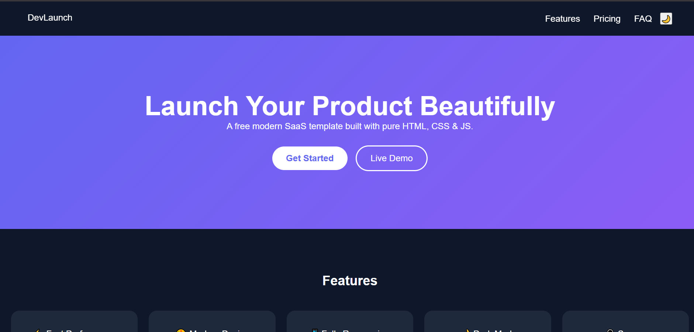

🚀 DevLaunch – Modern SaaS Landing Page Template

A free, modern, premium SaaS landing page template built using pure HTML, CSS, and JavaScript.
Clean design, responsive layout, dark mode, animations — ready for startups, developers, and agencies.

🌐 Live Demo

https://yourusername.github.io/devlaunch-modern-saas-template/

✨ Features

⚡ Modern SaaS UI

🎨 Clean & Premium Design

🌙 Dark / Light Mode Toggle

📱 Fully Responsive (Mobile First)

🎯 Smooth Scroll Navigation

💳 Pricing Section

💬 Testimonials Slider (Auto Rotate)

❓ FAQ Accordion

🚀 Easy to Customize

🔥 100% Free & Open Source

📸 Preview

/assets/preview.png

📂 Folder Structure
devlaunch-modern-saas-template/
│
├── index.html
├── css/
│ └── style.css
├── js/
│ └── script.js
└── README.md

🛠️ Built With

HTML5

CSS3 (Custom Properties, Flexbox, Grid)

Vanilla JavaScript (ES6)

Responsive Design Principles

🚀 How To Use

Clone the repository

git clone https://github.com/Haseeb-MernStack/devlaunch-modern-saas-template

Open folder

cd devlaunch-modern-saas-template

Open index.html in browser

That’s it 🎉

🌙 Dark Mode

Click the moon icon in the navbar to toggle between dark and light themes.

📱 Responsive Design

Desktop

Tablet

Mobile

Large screens

Fully optimized for all devices.

🎯 Customization Guide

You can easily customize:

Brand name → index.html

Colors → :root variables in style.css

Pricing plans → Pricing section

Testimonials → script.js

FAQ items → index.html

🤝 Contributing

Contributions, issues, and feature requests are welcome!

If you’d like to improve the template:

Fork the repo

Create a new branch

Submit a Pull Request

⭐ Support

If you like this project:

⭐ Star the repository

🍴 Fork it

📢 Share it with others

📄 License

This project is licensed under the MIT License.
You are free to use it for personal and commercial projects.

👨‍💻 Author

Built with ❤️ by Haseeb MernStack

GitHub: https://github.com/Haseeb-MernStack

YouTube: https://youtube.com/@haseebmernstack
